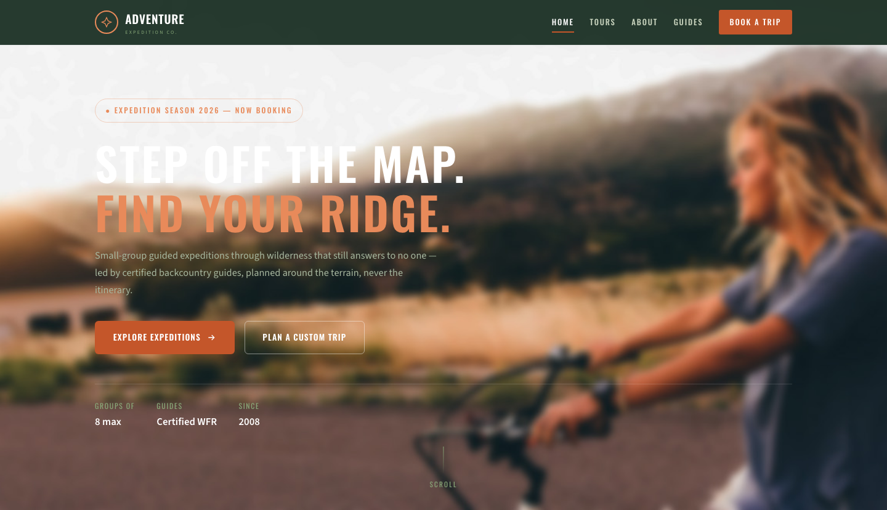

# Adventure — Guided Expedition &amp; Tour Company HTML Template

A premium, framework-free HTML template for a guided expedition and outdoor-tour company — hiking, climbing, river runs and wildlife safaris drawn with the look of a working field log. Deep forest green, rust-orange accent and parchment ground, set in Oswald display type with Source Sans body and topographic contour-line motifs.

## 📸 Screenshot

## Design System

| Token | Value |
|-------|-------|
| **Brand** | `--pine` `#1a3c2a` (deep forest), `--pine-dark` `#0f261a` |
| **Accent** | `--rust` `#c4562a` (rusted orange), `--rust-soft` `#e88a5a` |
| **Ground** | `--paper` `#f5f0e6` (parchment), `--paper-2` `#ece4d5` |
| **Support** | `--moss` `#5a7a5a`, `--moss-light` `#8aaa7a`, `--bark` `#3d2a1e` |
| **Motif** | Topographic contour-line backgrounds (CSS, 40px) + compass-rose mark |
| **Text** | `--ink` `#1e1a16`, `--muted` `#6b5f52` |
| **Display type** | `Oswald` (400–700, uppercase) |
| **Body type** | `Source Sans 3` (400–700) |
| **Container** | 1180px max-width, centered |
| **Radius** | 6px / 14px scale, 999px (pill) |
| **Breakpoints** | ~992px, ~576px |

## Pages

| Page | File | Description |
|------|------|-------------|
| Home | [index.html](index.html) | Full-viewport hero with auto-advancing expedition slideshow, story split, six activity cards, animated stats band, featured tours, guides, testimonial quote, CTA |
| Expeditions | [tours.html](tours.html) | Full trip catalog with dates/levels/prices, interactive trip-preview thumbnail switcher, and a six-image field gallery |
| About | [about.html](about.html) | Founding story, values, guide team, and an 18-season field-log timeline |
| Contact | [contact.html](contact.html) | Field-office info list, phone/email, and a trip-brief form with validation |
| 404 | [404.html](404.html) | On-brand error page with recovery links |

## Features

- **Framework-free** — pure HTML5, CSS3 (custom properties, Grid, Flexbox, `clamp()`), vanilla JavaScript
- **Field-log identity** — topographic contour-line backgrounds, compass-rose logo mark, expedition-log sheet coordinates in the footer
- **Distinct outdoor palette** — forest green + rust orange on parchment, Oswald + Source Sans 3
- **Fluid responsive** — two breakpoints, no horizontal scroll on any viewport
- **Hero slideshow** — auto-advancing expedition photos with pause on hover/touch
- **Scroll reveal** — IntersectionObserver-powered `.reveal` animations (respects `prefers-reduced-motion`)
- **Mobile nav** — burger toggle with `aria-expanded` accessible pattern
- **Trip preview** — thumbnail switcher that swaps the main route photo
- **Stat counters** — animated number counters triggered on scroll
- **Contact form** — trip-type select, validation, inline success/error status
- **Sticky header** — darkens and blurs on scroll
- **Original imagery** — real expedition photography from the source kit, no placeholders

## Tech Stack

- HTML5 + CSS3 (W3C-valid, semantic landmarks)
- Vanilla JavaScript (canonical IIFE build)
- Google Fonts (Oswald + Source Sans 3)
- SVG favicon (inline data: URI)

## SEO

- Semantic HTML5 structure (`<header>`, `<nav>`, `<main>`, `<section>`, `<footer>`)
- Unique `<title>` and `<meta description>` per page
- `lang="en"` attribute, `charset="utf-8"`, viewport meta
- Alt text on all images

## Getting Started

Open `index.html` in any modern browser — no build step required. To customize:

1. **Branding** — replace the logo text, contact details and social links in every page header/footer.
2. **Colors** — edit the CSS custom properties at the top of `assets/css/style.css`.
3. **Fonts** — swap the Google Fonts link in each page `<head>`.
4. **Images** — replace files in `assets/img/` keeping the same filenames.
5. **Trips** — add/remove `.trip-card` blocks in `tours.html` and `index.html`.

## License

Free for personal and commercial use. Attribution appreciated but not required.

---

## Let's Build Something Together 🚀

[Book a free consultation](https://tally.so/r/q4q1L9)
